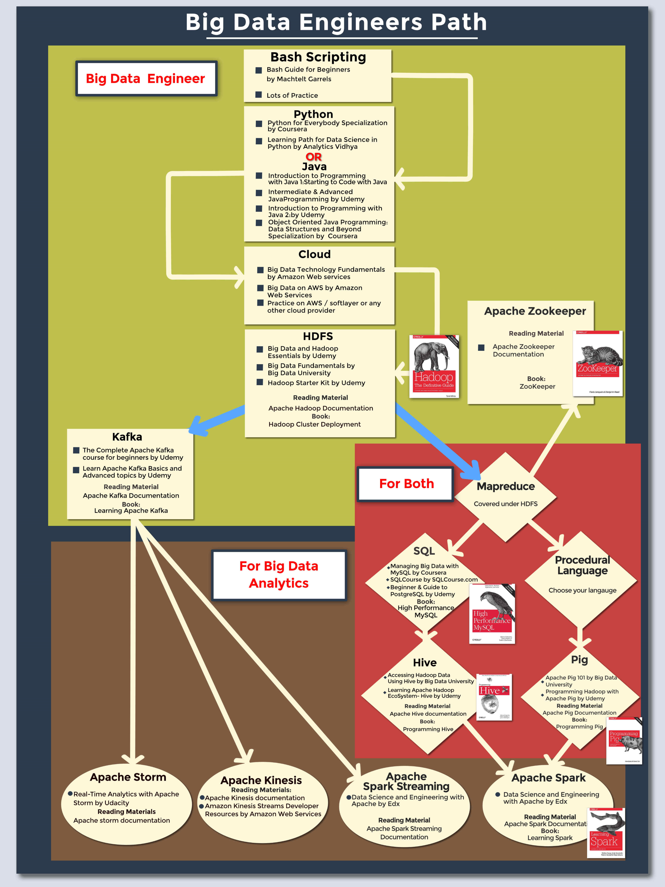

# 数据工程师学习指南

在大数据领域发展的职业路径中，有一套二元对立的职业技能发展体系：数据科学和数据工程。二者都有各自的侧重点，但它们之间相互依赖，任何一方的发展都离不开另一方。在实践中我们发现，任何一个体系都有博大精深的技能需要掌握，要想精通两个体系，做到面面俱到是不现实的，知识负担过重。因此我们应该把它们区分开，先弄清楚每个体系的侧重点，才能根据个人情况有的放矢的训练和培养相关技能。然后将相关人才有机组合起来，形成数据科学团队，才能发挥最强大的战斗力。这篇文章首先想要理清的是数据工程和数据科学之间的区别与联系，内涵与外延，然后在这个基础上整理和汇编了国内外的各种资源，重点回答一个问题：**如何系统的训练和提升数据工程技能**，特别是通过**自学**的方式。

# 一. 数据工程与数据科学的关系

**大数据**是一个多学科交叉的领域，涉及到计算机科学，数学以及相关领域知识的方方面面，对相关从业者的素质要求比较高。其所需要的专业技能大致可以分为两个方面：**数据科学**和**数据工程**。

**数据科学**人才的初级形态为数据分析师，高级形态为数据科学家。数学与统计学是数据科学家的核心，他们需要在很强的**数学和统计背景**基础上建立高级分析的能力，建立各种机器学习和深度学习模型。对于数据科学家而言，他们除了数学基础扎实，还需要理解业务领域，在充分理解业务的基础上分析数据，这需要一定的商业敏锐度，最后要以业务方能够理解的方式发布他们得到的成果，帮助业务方进行决策。数据科学家需要具有一定的编程能力，因为他们需要编程训练各种机器学习模型，甚至根据业务领域的特殊性对标准模型源代码进行修改，以提高模型的性能。

**数据工程**人才的初级形态为数据工程师，高级形态为数据架构师。编程能力是数据工程师的核心，这种能力和背景通常来自于计算机科学和软件工程。后端工程师转型成数据工程师具有先天的优势，因为知识都是相通的。他们的工作重点和专业能力主要放在**分布式系统**方面，数据架构师必须具备高级编程和系统架构能力。利用工程技能，数据工程师需要将10-30种不同的大数据技术整合到一起创建数据管道，构建和维护适用于数据收集，处理和部署数据密集型应用的数据结构和体系结构，将数据汇总给数据科学家，从而将模型投入生产。数据工程师必须深入理解各种技术和框架，以及如何选取合适的组件并将它们有机组合在一起来创建解决方案。数据工程中最受欢迎的技能之一是设计和构建**数据仓库**的能力。数据仓库是收集，存储和检索所有原始数据的地方。

数据科学家和数据工程师之间的技能一定存在着重叠区域，这个重叠区域包含**数据分析技能**，**编程技能**和**大数据技能**。数据科学家的分析技能远远超过数据工程师的分析技能，数据工程师可以懂一些基础到中级的分析技术，但很难进行数据科学家熟悉的高级数据分析。数据科学家和数据工程师在编程能力上还有一些重叠，但数据工程师的编程能力远远超过数据科学家的编程能力。数据工程师为数据科学家创建数据管道，ETL（提取，转换和载入）是数据工程师构建数据管道所遵循的步骤。他们的角色是互补的，数据工程为数据科学工作提供支撑。数据科学家和数据工程师在大数据方面还存在一个重叠：数据工程师通过高级编程和系统架构创建大数据管道，数据科学家运用他们的高级数学技能，通过数据管线创建高级数据产品。

一个数据科学团队的常见配置是1个数据科学家配2-3名数据工程师。在另外一些更复杂的情况下，可能需要为1个数据科学家配4-5名数据工程师，因为创建数据管道要比创建ML/AI部分花费更多的时间和精力。

# 二. 数据工程与云计算的关系

**AI+BigData+Cloud**可以说是当下信息产业的代名词。上面我们纵向比较了数据工程在大数据领域所处的位置以及它与数据科学之间的关系。这里我们还需要横向比较一下与数据工程有关的其他领域。其中我认为最重要的就是**云计算**技术。大数据是原料，云计算是容器。云计算的进步是大数据得以发展的基础条件。我们都知道，有一个概念叫**数据重力**，简单说就是所有的数据都要汇聚集中到一个地方然后才能进行分析。但传统的单机或者本地数据中心已经无法容纳海量的数据了。

云计算的出现就是要打破这种局限性，为海量的数据提供容器。云计算把众多的数据聚集起来，云端就成了数据分析最理想的发生点，要充分利用大数据的"大"，就要靠云计算技术实现。未来大数据的发展一定是和云计算共生的，即**数据往云端迁移**，数据的重心在云端。"云"作为一个海纳百川的数据中心，能激发大数据的真正潜力。

由此看来，数据工程师在培养和训练自己的数据工程技能的同时，也要理解和掌握**云计算**，这样才能充分的发挥数据工程的强大威力。

# 三. 数据工程成长路径

## 3.1 操作系统

1. [Linux服务器管理和安全](https://www.coursera.org/learn/linux-server-management-security)
2. [CS401：Operating Systems](https://learn.saylor.org/course/cs401)
3. [Bash Guide for Beginners](http://www.tldp.org/LDP/Bash-Beginners-Guide/html/)
4. 《现代操作系统》

5. 《Linux命令与shell脚本编程大全》

## 3.2 编程语言

### 3.2.1 Python语言

1. [Programming Languages Part A](https://www.coursera.org/learn/programming-languages)
2. [Programming Languages Part B](https://www.coursera.org/learn/programming-languages-part-b)
3. [Programming Languages Part C](https://www.coursera.org/learn/programming-languages-part-c)

4. [Coursera零基础Python入门专项课程](https://www.coursera.org/specializations/python)
5. [Python 3专项课程](https://www.coursera.org/specializations/python-3-programming)

6. [Python - 100天从新手到大师](https://github.com/jackfrued/Python-100-Days)

### 3.2.2 Java语言

1. 《Java编程思想》
2. 《Java并发编程实战》
3. [Object Oriented Java Programming: Data Structures and Beyond 专项课程](https://www.coursera.org/specializations/java-object-oriented)

### 3.2.3 Scala语言

1. [Functional Programming in Scala专项课程](https://www.coursera.org/specializations/scala)

### 3.2.4 Go语言

1. 《The Go Programming Language》

### 3.2.5 Rust语言

1. 《深入浅出Rust》
2. 《Rust编程之道》
3. [Operating Systems Design and Implementation]([http://web.stanford.edu/class/cs140e/index](http://web.stanford.edu/class/cs140e/index))

### 3.2.6 C++语言

1. [Udacity C++程序设计纳米学位](https://cn.udacity.com/course/c-plus-plus-nanodegree--nd213)
2. 《C++ Primer》

## 3.3 云计算

1. [AWS 大数据技术基础知识](https://aws.amazon.com/cn/training/course-descriptions/bigdata-fundamentals/)
2. [Big Data on AWS](https://aws.amazon.com/cn/training/course-descriptions/bigdata/)
3. [Udacity云计算软件开发纳米学位](https://cn.udacity.com/course/cloud-developer-nanodegree--nd9990-cn)
4. [Udacity云计算DevOps](https://cn.udacity.com/course/cloud-dev-ops-nanodegree--nd9991-cn)
5. [Data Engineering on Google Cloud Platform专项课程](https://www.coursera.org/specializations/gcp-data-machine-learning?utm_source=googlecloud&utm_medium=institutions&utm_campaign=GoogleCloud_Training_Data_ML_DE)
6. [Preparing for the Google Cloud Professional Data Engineer EXam](https://www.coursera.org/learn/preparing-cloud-professional-data-engineer-exam?utm_source=googlecloud&utm_medium=institutions&utm_campaign=GoogleCloud_Cert_Prep_PDE)
7. [Google Cloud Platform Fundamentals: Core Infrastructure](https://www.coursera.org/learn/gcp-fundamentals)

## 3.4 分布式存储

### 3.4.1 HDFS

1. [Google的GFS论文](https://static.googleusercontent.com/media/research.google.com/en//archive/gfs-sosp2003.pdf)
2. [Big Data and Hadoop Essentials](https://www.udemy.com/big-data-and-hadoop-essentials-free-tutorial/)
3. [Big Data Fundamentals](https://cognitiveclass.ai/learn/big-data/)
4. [Hadoop Starter Kit](https://www.udemy.com/hadoopstarterkit/)

5. [Hadoop基础知识](https://cognitiveclass.ai/learn/hadoop/)

6. [HortonWorks教程](https://hortonworks.com/tutorials/)

7. [Hadoop详解](https://www.packtpub.com/free-ebooks/hadoop-explained)

8. [Hadoop：你应该了解的](https://www.oreilly.com/library/view/hadoop-what-you/9781492042372/?intcmp=il-data-free-lp-lgen_free_reports_page)

9. 《Hadoop：The Definitive Guide》

## 3.5 分布式协调

### 3.5.1 Apache Zookeeper

1. 《ZooKeeper》

## 3.6 消息队列

### 3.6.1 Apache Kafka

1. [The Complete Apache Kafka course for beginners](https://www.udemy.com/apache-kafka-tutorial-for-beginners/)
2. [Learning Apache Kafka Basics and Advanced topics](https://www.udemy.com/learn-apache-kafka-basics-and-advanced-topics/)
3. [使用Apache Kafka简化数据管道](https://cognitiveclass.ai/courses/simplifyingdatapipelines/)
4. [用Kafka给数据科学家赋能](https://cognitiveclass.ai/courses/simplifyingdatapipelines/)
5. 《Learning Apache Kafka》

### 3.6.2 ActiveMQ

1. JavaEE企业级架构师课程-ActiveMQ

## 3.7 SQL数据库

1. [使用MySQL管理大数据](https://www.coursera.org/learn/analytics-mysql)
2. [Beginner's Guide to PostgreSQL](https://www.udemy.com/beginners-guide-to-postgresql/)
3. [MySQL教程](http://www.mysqltutorial.org/)
4. [PostgreSQL教程](http://www.postgresqltutorial.com/)
5. [Oracle Live SQL](https://livesql.oracle.com/apex/f?p=590:1000)
6. 《高性能MySQL》
7. 《SQL基础教程》
8. 《SQL进阶教程》

## 3.8 交互式数据分析

### 3.8.1 Apache Hive

1. [Accessing Hadoop Data Using Hive](https://cognitiveclass.ai/courses/hadoop-hive/)
2. 《Programming Hive》

### 3.8.2 Apache Pig

1. [Apache Pig 101](https://cognitiveclass.ai/courses/introduction-to-pig/)
2. 《Programming Pig》

### 3.8.3 Apache Kylin

1. [Apache Kylin主页]([http://kylin.apache.org/cn/](http://kylin.apache.org/cn/))

## 3.9 分布式计算

### 3.9.1 离线批处理

#### 3.9.1.1 MapReduce

1. [Introduction to MapReduce](https://www.analyticsvidhya.com/blog/2014/05/introduction-mapreduce/)
2. [Hadoop beyond traditional MapReduce](https://www.analyticsvidhya.com/blog/2014/11/hadoop-mapreduce/)
3. [使用MapReduce进行数据密集型文本处理](https://lintool.github.io/MapReduceAlgorithms/MapReduce-book-final.pdf)

### 3.9.2 流式计算

#### 3.9.2.1 Apache Storm

1. [用 Apache Storm 进行实时分析](https://cn.udacity.com/course/real-time-analytics-with-apache-storm--ud381)

#### 3.9.2.2 Amazon Kinesis

1. [Amazon Kinesis 文档](https://docs.aws.amazon.com/kinesis/index.html)
2. [Amazon Kinesis Data Streams 资源](https://aws.amazon.com/cn/kinesis/data-streams/resources/)

#### 3.9.2.3 Apache Samza

1. [Apache Samza 文档]([http://samza.apache.org/](http://samza.apache.org/))

#### 3.9.2.4 Apache Flink

1. [Apache Flink 文档](https://flink.apache.org/)

### 3.9.3 内存计算

#### 3.9.3.1 Apache Spark

1. [Data Science and Engineering With Spark](https://www.edx.org/xseries/data-science-engineering-apacher-sparktm)
2. [Udacity数据工程师纳米学位](https://cn.udacity.com/course/data-engineer-nanodegree--nd027)
3. [Comprehensive Introduction to Apache Spark, RDDs & Dataframes](https://www.analyticsvidhya.com/blog/2016/09/comprehensive-introduction-to-apache-spark-rdds-dataframes-using-pyspark/)
4. [初学者学习Spark R的详细指南](https://www.analyticsvidhya.com/blog/2016/06/learning-path-step-step-guide-beginners-learn-sparkr/)
5. [Spark的基础知识](https://cognitiveclass.ai/courses/what-is-spark/)
6. [Apache Spark和AWS简介](https://www.udemy.com/big-data-with-apache-spark-and-aws/)
7. 《Learning Spark》

## 3.10 NoSQL数据库

### 3.10.1 KV数据库

#### 3.10.1.1 Redis

1. [Redis University](https://university.redislabs.com/)

### 3.10.2 列式存储数据库

#### 3.10.2.1 HBASE

1. [Google Big Table论文](https://static.googleusercontent.com/media/research.google.com/en//archive/bigtable-osdi06.pdf)

#### 3.10.2.2 Cassandra

1. [Cassandra Tutorial](https://www.tutorialspoint.com/cassandra/index.htm)

### 3.10.3 文档数据库

#### 3.10.3.1 MongoDB

1. [Introduction to MongoDB](https://www.coursera.org/learn/introduction-mongodb)
2. [MongoDB在线课程合集](https://university.mongodb.com/courses/catalog)

#### 3.10.3.2 Couchbase

1. [Couchbase Training](https://learn.couchbase.com/store)

##3.11 资源调度

1. [IBM微服务专项课程](https://www.coursera.org/specializations/ibm-microservices)

## 3.12 日志采集

1. [Flume教程](https://www.tutorialspoint.com/apache_flume)

## 3.13 RPC框架

1. [网络编程实践](https://boolan.com/course/10093)

2. 《Netty in Action》

3. 《Linux多线程服务端编程》

## 3.14 综合资料

### 3.14.1 Airbnb数据工程入门

1. [数据工程入门指南Part I](https://medium.com/@rchang/a-beginners-guide-to-data-engineering-part-i-4227c5c457d7)

2. [数据工程入门指南PartII](https://medium.com/@rchang/a-beginners-guide-to-data-engineering-part-ii-47c4e7cbda71)

3. [数据工程入门指南PartIII](https://medium.com/@rchang/a-beginners-guide-to-data-engineering-the-series-finale-2cc92ff14b0)

### 3.14.2 O'Reilly免费数据工程电子书套件

1. [O'Reilly的免费数据工程电子书套件](https://www.oreilly.com/data/free/)

### 3.14.3 数据工程综合课程

1. [Big Data for Data Engineers](https://www.coursera.org/specializations/big-data-engineering)
2. [大数据专项课程](https://www.coursera.org/specializations/big-data)
3. [IBM数据科学专业证书](https://www.coursera.org/specializations/ibm-data-science-professional-certificate)
4. [IBM高级数据科学专项课程](https://www.coursera.org/specializations/advanced-data-science-ibm)
5. [物联网程序设计专项课程](https://www.coursera.org/specializations/iot)
6. 《数据密集型应用系统设计》

### 3.14.4 24个终极数据科学项目

1. [提升你知识和技能的24个终极数据科学项目](https://www.analyticsvidhya.com/blog/2018/05/24-ultimate-data-science-projects-to-boost-your-knowledge-and-skills/)

# 四. 数据工程师必备前置知识

## 4.1 分布式系统基础知识

1. [一致性哈希算法](https://en.wikipedia.org/wiki/Consistent_hashing)

2. [CAP理论](https://en.wikipedia.org/wiki/CAP_theorem)

3. [幂等性：很多分布式系统状态管理的基石](https://mortoray.com/2014/09/05/what-is-an-idempotent-function/)

4. 各种一致性模型：强一致性、弱一致性、最终一致性

5. 备份机制：主从的叫法已经不怎么流行了，当前更cool的叫法是Leader-Follower模式

6. 共识协议：国内通常翻译成一致性协议(consensus protocol)。学习常见的几种：Paxos和Raft

## 4.2 机器学习基础知识

1. [机器学习新手指南](https://www.analyticsvidhya.com/blog/2015/06/machine-learning-basics/)
2. [机器学习算法基础知识](https://www.analyticsvidhya.com/blog/2017/09/common-machine-learning-algorithms/)
3. [新手必读的机器学习和人工智能书籍](https://www.analyticsvidhya.com/blog/2018/10/read-books-for-beginners-machine-learning-artificial-intelligence/)

# 五. 数据工程培养计划

先学习数据工程，云计算和DevOps三个纳米学位，建立全局观，然后在沿着学习路径将数据工程各模块知识各个击破。

查阅大量的课外资料作为补充，写各种各样的文章来进行知识总结

技能才是学习的终点，以实战项目为中心进行课程设计，用信息和知识来磨炼技能。课程设计的方法：确定目标人群，确定学习目标和学习时长，然后根据这些目标合理拆分并制作内容。

# 六. 数据工程相关认证考试

## 6.1 [谷歌认证专家](https://cloud.google.com/certification/data-engineer)

目前最重要的数据工程认证之一，要获得这个证书需要通过2小时的考试，题目是多项选择题，该网页提供了一些实际操作谷歌云技术的实践指南。

## 6.2 [IBM认证数据工程师](https://www.ibm.com/certify/cert?id=50001501)

考试包括54个问题，必须正确回答44个才能通过，这里提供了进一步的学习资料，可以参考这些资料进行准备。[这里](https://www.ibm.com/certify/exam?id=C2090-101)是考试页面。

## 6.3 Cloudera的CCP数据工程师

另一个全球公认的认证，相当于具有挑战性，需要有一些使用数据工程工具的实践经验。

1. [Cloudera的CCP数据工程师](https://www.cloudera.com/more/training/certification/ccp-data-engineer.html)

路漫漫其修远兮，吾将上下而求索。

# 七. 参考文献

1. [数据工程师vs数据科学家](https://mp.weixin.qq.com/s?__biz=MzIyODE5MTcxNw==&mid=2650373641&idx=1&sn=8a60278fbabc086996293032b08780b1&chksm=f0586283c72feb9583e78f4a2393e89c05db1740740630ff49b4b9f4dd9af01cb053c8b23118&mpshare=1&scene=1&srcid=1207dBJd8Vbzh2esCSxTqSfp#rd)
2. [终于可以弄明白大数据、云计算、商业智能到底什么关系了](https://daily.zhihu.com/story/9342788?utm_campaign=in_app_share&utm_medium=iOS&utm_source=weixin&from=singlemessage&isappinstalled=1)
3. [Big Data Learning Path for all Engineers and Data Scientists out there](https://www.analyticsvidhya.com/blog/2017/03/big-data-learning-path-for-all-engineers-and-data-scientists-out-there/)
4. [一份数据工程师必备的学习资源，干货满满（附链接）](https://www.jiqizhixin.com/articles/2019-01-25-15)

